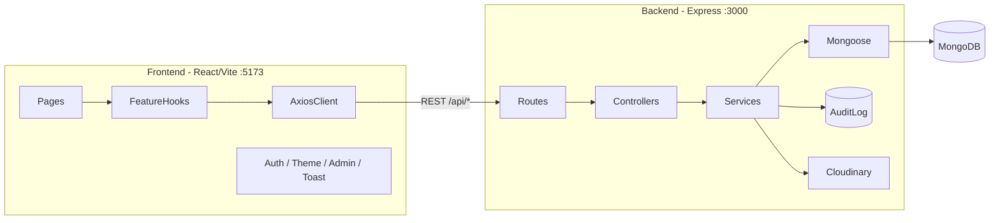

# Guru Inventory Management

Product inventory management system built with React + Node.js + Express. Supports product CRUD, status workflows, bulk actions, audit logging, and admin role simulation.

## Prerequisites

| Requirement | Notes |
|---|---|
| **Node.js** | 18+ recommended |
| **npm** | Lockfiles are committed in both packages (`package-lock.json`) |
| **MongoDB** | Local instance on port 27017, or a MongoDB Atlas connection string |
| **SMTP** | Required for email verification and password reset (Gmail app password works) |
| **Cloudinary** | Required for product image uploads |
| **Slack** | Optional — operational alerts only; disabled by default |

## Quick Start

Run backend and frontend in **separate terminals**.

### 1. Backend setup

Ensure MongoDB is running, then configure and start the API:

```bash
cd backend
cp .env.example .env
```

Edit `backend/.env` and set at minimum:

- `MONGODB_URI`
- `SECRET_KEY` (at least 32 characters)
- `ADMIN_HEADER_VALUE` (at least 16 characters)
- `MAIL_*` (SMTP credentials)
- `CLOUDINARY_*` (cloud name, API key, API secret)

Generate random secrets:

```bash
node -e "console.log(require('crypto').randomBytes(64).toString('hex'))"
```

Start the backend:

```bash
cd backend
npm install
npm run dev
```

Dev server runs at **http://localhost:3000** (`tsx watch src/index.ts`).


### 2. Frontend setup

```bash
cd frontend
cp .env.example .env
```

Edit `frontend/.env`:

- `VITE_API_URL=http://localhost:3000`
- `VITE_ADMIN_HEADER_VALUE` must match `ADMIN_HEADER_VALUE` in `backend/.env` exactly

Start the frontend:

```bash
cd frontend
npm install
npm run dev
```

Dev server runs at **http://localhost:5173**.


### 3. Verify it works

1. Open **http://localhost:5173**
2. Register a new account
3. Verify your email via the link sent to your SMTP inbox
4. Log in — you are redirected to `/products`
5. Toggle **Act as Admin** in the header to simulate admin privileges (sends the `x-admin-role` header on every request)

Health check:

```bash
curl http://localhost:3000/health
# → { "status": "ok" }
```

### 4. Optional: Slack alerts

Slack webhooks are **disabled by default** (`SLACK_ALERTS_ENABLED=false`). The app runs fully without Slack.

To enable fire-and-forget operational notifications, set in `backend/.env`:

```bash
SLACK_ALERTS_ENABLED=true
SLACK_WEBHOOK_URL_NEW_USERS=https://hooks.slack.com/services/...
SLACK_WEBHOOK_URL_ALERTS_SECURITY=https://hooks.slack.com/services/...
SLACK_WEBHOOK_URL_INVENTORY_STATUS_OPS=https://hooks.slack.com/services/...
SLACK_WEBHOOK_URL_INVENTORY_BULK_ACTIONS=https://hooks.slack.com/services/...
SLACK_WEBHOOK_URL_INVENTORY_AUDIT_OVERRIDE=https://hooks.slack.com/services/...
```

You can use one webhook URL for all channels or separate webhooks per event type. Notifications never block API responses — failures are logged to the console only.

| Event | Webhook variable |
|---|---|
| New user registration | `SLACK_WEBHOOK_URL_NEW_USERS` |
| Failed login threshold / rate limiting | `SLACK_WEBHOOK_URL_ALERTS_SECURITY` |
| Product status change | `SLACK_WEBHOOK_URL_INVENTORY_STATUS_OPS` |
| Bulk delete or bulk status change | `SLACK_WEBHOOK_URL_INVENTORY_BULK_ACTIONS` |
| Admin demotion from Delivered (audit override) | `SLACK_WEBHOOK_URL_INVENTORY_AUDIT_OVERRIDE` |

Implementation: [`backend/src/services/slackNotifier.ts`](backend/src/services/slackNotifier.ts).

## Architecture

The project is split into two independent packages (no monorepo root):

| Package | Stack | Responsibility |
|---|---|---|
| `backend/` | Node.js, Express 5, TypeScript, Mongoose | REST API, business rules, auth, audit log, image upload |
| `frontend/` | React 19, Vite 8, TypeScript, Tailwind v4 | SPA UI, forms, optimistic updates, PWA |



### Backend layers (`backend/src/`)

| Layer | Role |
|---|---|
| `routes/` | HTTP route wiring |
| `controllers/` | Parse request, build `ActorContext`, return JSON |
| `services/` | Business logic — `productService.ts` is the source of truth for inventory rules |
| `models/` | Mongoose schemas (`Product`, `AuditLog`, `User`) |
| `validators/` | Zod request schemas |
| `middleware/` | Auth, validation, rate limiting, upload, error handling |

### Frontend layers (`frontend/src/`)

| Layer | Role |
|---|---|
| `pages/` | Route-level screens |
| `features/products/` | Domain module — API calls, React Query hooks, components, types |
| `components/` | Shared UI and layouts |
| `contexts/` | Auth, theme, admin override, toasts |
| `lib/api.ts` | Shared Axios client with credentials and admin header interceptor |

**Data flow:** The frontend provides UX validation only. The backend enforces MAC/IMEI format, status prerequisites, admin-only demotion from Delivered, and writes audit entries atomically with product changes (MongoDB transactions).

## Key Decisions

### Architecture

| Decision | Why | Tradeoff |
|---|---|---|
| Separate `backend/` + `frontend/` packages | Matches the assignment split; each side can deploy independently | No shared types package — API types are duplicated in the frontend |
| Layered backend (routes → controllers → services) | Clear separation; business rules live in one place | More files than a flat Express app |
| Feature-sliced frontend (`features/products/`) | Domain logic is colocated; easy to extend with more features | Slightly heavier than a flat `components/` tree |

### Libraries

| Choice | Over | Rationale |
|---|---|---|
| **MongoDB + Mongoose** | JSON file / SQL | Flexible schema for assignment fields; native transactions for audit + product atomicity |
| **Zod** (both sides) | Manual validation / Joi | Shared pattern; type-safe env and request validation on backend; form schemas on frontend |
| **TanStack Query** | Redux / raw fetch | Built-in cache, mutations, optimistic rollback; less boilerplate |
| **Tailwind CSS v4** | MUI | Full control over responsive mobile-first design; smaller bundle; no component library lock-in |
| **react-hook-form + zod resolver** | Uncontrolled forms | Performance on large forms; declarative validation |
| **Axios + cookies** | fetch | Simple `withCredentials` for HttpOnly JWT cookies |
| **Cloudinary** | Local disk storage | No file-system coupling; CDN URLs for the `imageUrl` field |
| **vite-plugin-pwa** | None | Offline shell and installable app |

### Business rules

| Decision | Why |
|---|---|
| Rules in `productService.ts`, not controllers | Single enforcement point; bulk and single operations share the same logic |
| Audit log in MongoDB (`AuditLog` collection) | Queryable per product; transactional with status changes; scales beyond file append |
| Admin via header **and** JWT role | Header satisfies the assignment spec; JWT role supports real admin users |
| Dedicated `PATCH /:id/status` endpoint | Separates status workflow from field edits (assignment requirement) |
| Bulk endpoints return per-item `{ success, failed }` | Partial failure is expected; the frontend shows per-row results |

### Frontend UX

| Decision | Why |
|---|---|
| Optimistic UI for delete/status only | Instant feedback on frequent actions; create/update wait for the server (image upload complexity) |
| Class-based dark mode on `<html>` | Works with Tailwind v4 `@custom-variant dark`; persists in `localStorage` |
| Mobile-first responsive table | Assignment requires full breakpoint coverage (cards / horizontal scroll on small screens) |
| i18n (en/he) beyond spec | Better UX for Hebrew-speaking users; UI strings remain primarily English |

### Auth (beyond minimum spec)

| Decision | Why | Tradeoff |
|---|---|---|
| Full JWT auth with email verification | Production-realistic; protects all product routes | Requires SMTP setup to run locally; more moving parts than header-only demo |
| Rate limiting on auth routes | Security best practice | Stricter local testing if hammering login |

### Slack (optional ops notifications)

| Decision | Why | Tradeoff |
|---|---|---|
| Slack webhooks via `slackNotifier.ts` | Real-time visibility for security and inventory events without building a dashboard | Requires Slack workspace setup; not needed for local dev |
| Disabled by default (`SLACK_ALERTS_ENABLED=false`) | Keeps local setup simple; no external dependency for reviewers | Alerts are off until explicitly configured |
| Fire-and-forget (`void notify…()`) | API latency unaffected if Slack is slow or down | Failed notifications are only logged, not retried |

### Security

- Helmet + CORS allowlist (`FRONTEND_URLS`)
- HttpOnly cookies for JWT tokens
- Timing-safe compare for admin header value
- Rate limiting on auth endpoints

## Environment Variables Reference

Full templates with comments are in:

- [`backend/.env.example`](backend/.env.example) — server, database, JWT, admin header, SMTP, Cloudinary, Slack
- [`frontend/.env.example`](frontend/.env.example) — API URL, admin header (must match backend), upload size limit

**Backend — required to start:**

| Variable | Purpose |
|---|---|
| `MONGODB_URI` | MongoDB connection string |
| `SECRET_KEY` | JWT signing key (32+ chars) |
| `ADMIN_HEADER_VALUE` | Admin simulation token (16+ chars) |
| `MAIL_SERVER`, `MAIL_USERNAME`, `MAIL_PASSWORD`, `MAIL_FROM` | SMTP for verification / reset emails |
| `CLOUDINARY_CLOUD_NAME`, `CLOUDINARY_API_KEY`, `CLOUDINARY_API_SECRET` | Image uploads |

**Frontend — required:**

| Variable | Purpose |
|---|---|
| `VITE_API_URL` | Backend base URL (default `http://localhost:3000`) |
| `VITE_ADMIN_HEADER_NAME` | Must match `ADMIN_HEADER_NAME` in backend (default `x-admin-role`) |
| `VITE_ADMIN_HEADER_VALUE` | Must match `ADMIN_HEADER_VALUE` in backend exactly |

**Backend — optional (Slack alerts):**

| Variable | Purpose |
|---|---|
| `SLACK_ALERTS_ENABLED` | Set to `true` to enable notifications (default `false`) |
| `SLACK_WEBHOOK_URL_NEW_USERS` | New user registration |
| `SLACK_WEBHOOK_URL_ALERTS_SECURITY` | Failed logins, rate limiting |
| `SLACK_WEBHOOK_URL_INVENTORY_STATUS_OPS` | Single product status changes |
| `SLACK_WEBHOOK_URL_INVENTORY_BULK_ACTIONS` | Bulk delete / bulk status |
| `SLACK_WEBHOOK_URL_INVENTORY_AUDIT_OVERRIDE` | Admin demotion from Delivered |

## API Overview

| Method | Path | Auth | Description |
|---|---|---|---|
| GET | `/health` | No | Health check |
| POST | `/api/auth/register` | No | Create account |
| POST | `/api/auth/login` | No | Log in (sets JWT cookies) |
| GET | `/api/auth/me` | Yes | Current user |
| GET | `/api/products` | Yes | List products (search, filter, pagination) |
| POST | `/api/products` | Yes | Create product |
| GET | `/api/products/:id` | Yes | Get product by ID |
| PUT | `/api/products/:id` | Yes | Update product fields |
| DELETE | `/api/products/:id` | Yes | Delete product |
| PATCH | `/api/products/:id/status` | Yes | Change product status |
| GET | `/api/products/:id/audit-log` | Yes | Status change history |
| POST | `/api/products/bulk-delete` | Yes | Bulk delete |
| POST | `/api/products/bulk-status` | Yes | Bulk status change |
| POST | `/api/products/upload` | Yes | Upload product image |

## What I'd Add With More Time

The current scope covers inventory and product lifecycle. With additional time, I would extend the system toward **customer understanding and upsell opportunities**:

- **Customer profile card** — a dedicated view per `customerId` showing assigned products, delivery history, status timeline, and contact details in one place (today `customerId` is only a field on the product).
- **Needs discovery** — when a customer or prospect contacts the company, capture their use case, environment, and constraints (e.g. fleet size, connectivity, deployment stage) so the team understands *why* they need a product, not just *which* SKU was assigned.
- **Recommendations** — based on what the customer already has and what stage they are in (Stock In → Delivered), suggest logical next products, accessories, or services (e.g. configuration support, replacement units, bulk rollout).

This would turn the app from pure inventory tracking into a lightweight CRM layer on top of the same product and audit data, without changing the backend-as-source-of-truth principle for status rules.

Other improvements I would consider: automated tests (API + UI), a shared types package between frontend and backend, and a dev-mode mail catcher so reviewers can run the app without real SMTP.

## AI Tools Used

I used **Cursor** (AI-assisted IDE) during this project:

- **Planning and architecture** — consulted on project structure, layer separation, library choices, and tradeoffs before implementing.
- **Code generation and review** — used AI to draft and iterate on boilerplate, components, and service logic; I reviewed, adjusted, and validated all output to match the assignment requirements.

All architectural and business-rule decisions were made consciously; I can explain any part of the codebase in the follow-up interview.
